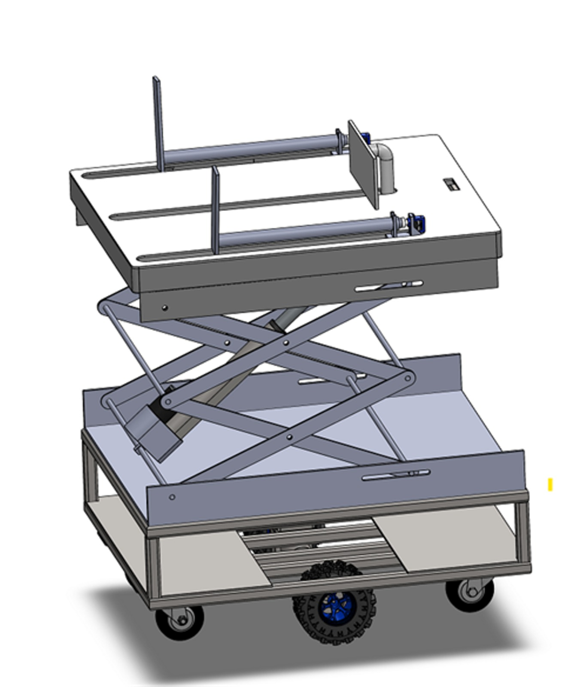
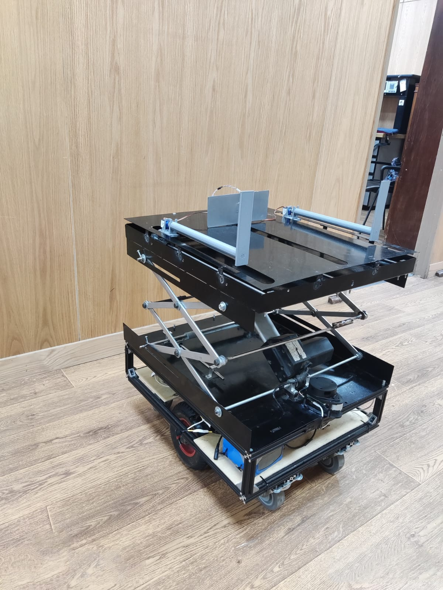
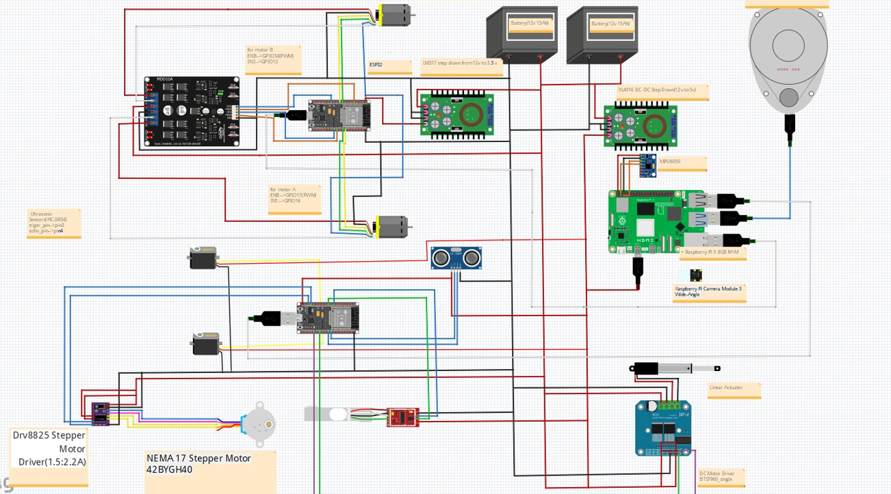
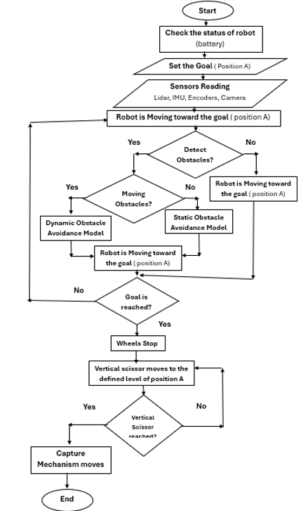
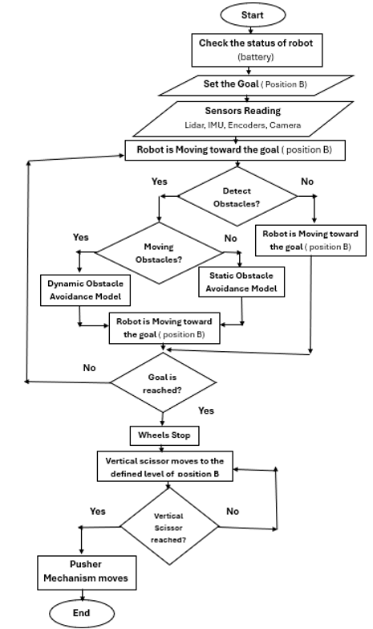
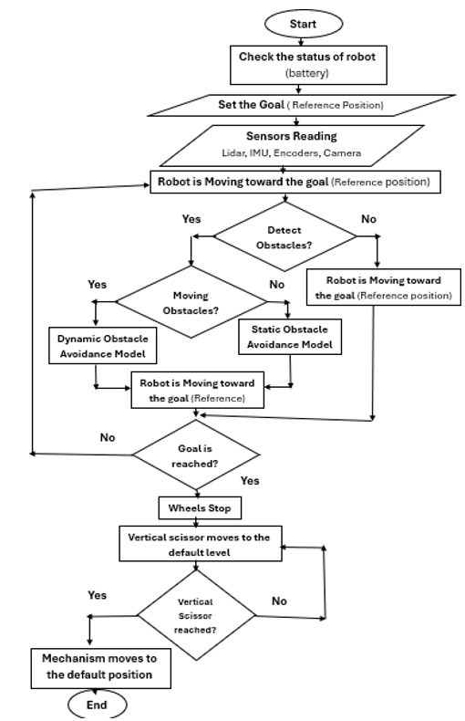

# Autonomous Baggage Transport and Loading Robot (ABTLR)

## Overview
The **Autonomous Baggage Transport and Loading Robot (ABTLR)** is an intelligent robotic system designed to autonomously transport, lift, load, and unload baggage in airports and warehouses. The system improves operational efficiency, reduces manual labor, and enhances the safety and reliability of baggage handling through autonomous navigation, obstacle avoidance, and precise material handling.

## Operation
The **ABTLR** project is designed for logistics operations and can be applied in airports and warehouses. Its purpose is to automate baggage transportation from the conveyor area (**Position A**) to the storage area (**Position B**).

The robot first navigates autonomously to **Position A** while avoiding obstacles. Upon arrival, the scissor mechanism rises to a specific level, and the loading mechanism moves forward to capture the baggage. After securing the bag using the gripper, the mechanism retracts.

Next, the robot navigates from **Position A** to **Position B**. Once it reaches the destination, it adjusts its height using the scissor mechanism, then moves the mechanism forward to place the baggage into the designated storage area. This process repeats continuously as long as baggage is available. After completing its tasks, the robot returns to its home position, and all mechanisms return to their initial states.

## Mechanical Design

The mechanical design of the **Autonomous Baggage Transport and Loading Robot (ABTLR)** consists of three main subsystems.

- ### Base
A differential-drive mobile platform that supports all robot components and enables stable autonomous navigation using two driven wheels and four caster wheels.

- ### Scissor Mechanism
A vertically actuated lifting system powered by a linear actuator, used to adjust the height of the loading mechanism for baggage pickup and placement at different storage levels.

- ### Pusher/Capture Mechanism
A horizontal lead screw-driven mechanism responsible for baggage handling. The capture unit uses servo-actuated grippers to securely grasp the baggage, while the pusher transfers and releases it accurately into the designated storage location.

  
  

## Electrical System
- 24V/30A DC Rechargeable Battery
- 24V/12V Step-Down Converter
- 24V/5V Step-Down Converter
- Linear Actuator
- 2 DC Motors
- 2 Servo Motors
- Stepper Motor
- Cytron DC Driver
- Servo Motor Driver
- Stepper Motor Driver
- Leadscrew
- RPLiDAR A1M8
- Raspberry Pi 5 8GB
- 2 ESP32
- MPU-6050
 

  
  

## Software System

The software system of the **Autonomous Baggage Transport and Loading Robot (ABTLR)** is developed using **ROS 2 Jazzy** and consists of the following main modules.

- #### Robot Control
Controls the robot's movement and coordinates the operation of the scissor lift, gripper, and pusher mechanisms.

- #### Localization and Mapping
Uses **SLAM Toolbox** to generate maps and **AMCL** for accurate localization within a known environment.

- #### Navigation
Employs the **A\*** algorithm for global path planning and the **Dynamic Window Approach (DWA)** for local path planning and obstacle avoidance.

- #### Sensor Fusion
Integrates data from wheel encoders and the **MPU6050 IMU** using an **Extended Kalman Filter (EKF)** to improve localization accuracy.

- #### Perception
Uses the **RPLIDAR A1M8** to detect obstacles and provide environmental information for mapping and navigation.

- #### Communication
ROS 2 nodes running on a **Raspberry Pi 5** communicate with **ESP32** microcontrollers via **Wi-Fi** to execute motor control and mechanism operations.

## Flowchart

<table align="center">
  <tr>
    <td align="center">
       
      <b>(a)</b>
    </td>
    <td align="center">
       
      <b>(b)</b>
    </td>
    <td align="center">
       
      <b>(c)</b>
    </td>
  </tr>
</table>
 

## Demonstration Video

### Watch the simulation of the project by clicking the button below.

  

### Watch the physical implementation of the project by clicking the button below.

  

### Watch the test of the project by clicking the button below.

  

## Technologies Used

- ROS 2 Jazzy
- Gazebo
- Rviz2
- Navigation2
- SLAM Toolbox
- AMCL
- Extended Kalman Filter (EKF)
- A* Path Planning
- Dynamic Window Approach (DWA)
- Raspberry Pi 5
- ESP32
- micro-ROS
- RPLIDAR A1M8
- MPU6050
- SolidWorks
- MATLAB
- C++
- Python

